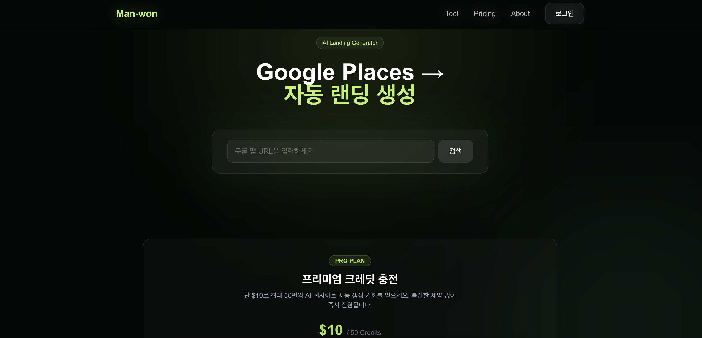
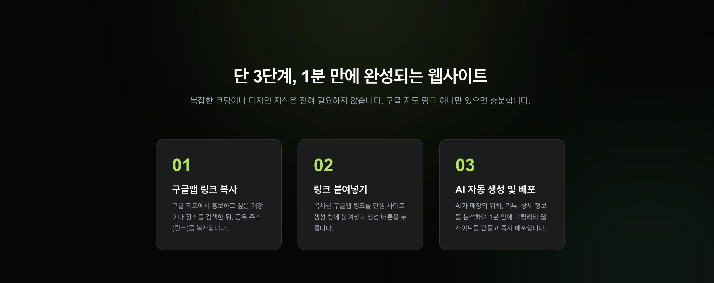
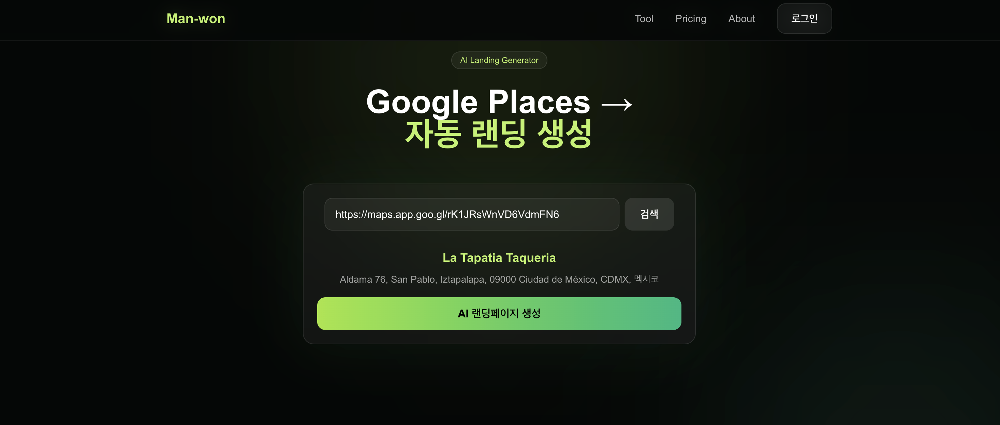
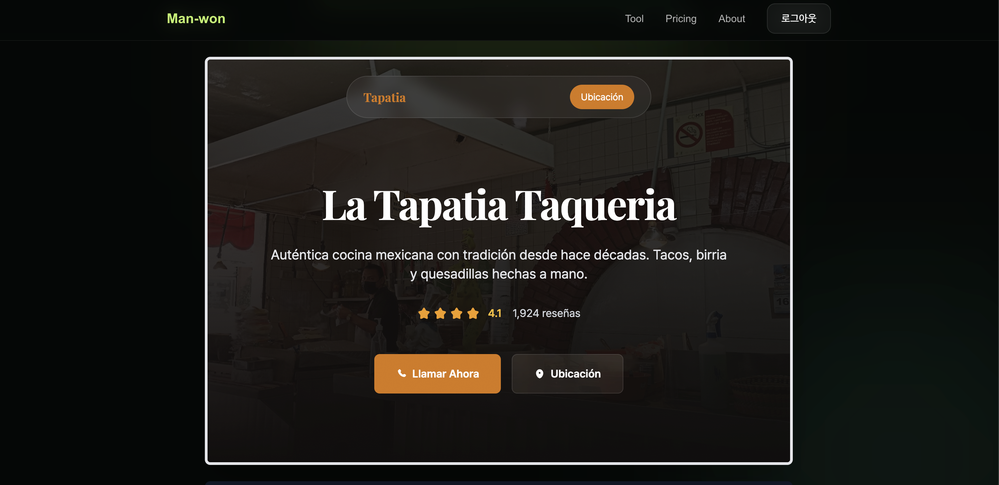

# Man-Won Site

An AI-powered SaaS platform that generates SEO-friendly business landing pages from Google Maps data using AI-generated content and customizable templates.

## Live Demo

https://man-won.site/

## Features

- Generate landing pages from Google Maps business information
- AI-generated website content and copywriting
- Authentication and user management with Supabase Auth
- Dashboard for creating and managing websites
- Dynamic templates for different business types
- Responsive design for desktop and mobile devices
- SEO-friendly landing pages

## Screenshots

### Home Page


### How It Works


### Generated Landing Page Link


### Generated Landing Page


## Tech Stack

### Frontend
- Next.js 14
- React
- TypeScript
- Tailwind CSS

### Backend & Database
- Supabase
- PostgreSQL
- Supabase Auth

### APIs & Integrations
- Google Places API
- Anthropic API
- Google OAuth

### Deployment
- Vercel

## Architecture

1. User searches for a business using Google Maps data.
2. Business information is fetched through the Google Places API.
3. AI generates website content based on the business profile.
4. The generated content is stored in Supabase.
5. A landing page is automatically created and published.

## Technical Challenges

### Dynamic Template System
Built a reusable template architecture that allows different business types to share the same codebase while maintaining customizable content.

### AI Content Generation
Implemented an AI workflow that generates business descriptions and landing page copy automatically.

### Authentication and Data Management
Designed a scalable authentication and database structure using Supabase Auth and PostgreSQL.

### SEO Optimization
Implemented server-side rendering and metadata generation for better search engine visibility.

### Structured AI Output
Designed prompts and validation logic to transform AI responses into reusable page components.

## Future Improvements

- Payment integration
- Multi-language support
- Additional templates
- Analytics dashboard
- AI branding tools

## Local Development

```bash
git clone https://github.com/ginikang3/manwon.site.git
cd manwon.site
npm install
npm run dev
```

## Environment Variables

```env
NEXT_PUBLIC_SUPABASE_URL=
NEXT_PUBLIC_SUPABASE_ANON_KEY=
GOOGLE_MAPS_API_KEY=
ANTHROPIC_API_KEY=
GOOGLE_CLIENT_ID=
GOOGLE_CLIENT_SECRET=
```

Create a `.env.local` file and add the required environment variables.

## Author

Suhun Kang

Portfolio: https://web.man-won.site/
GitHub: https://github.com/ginikang3